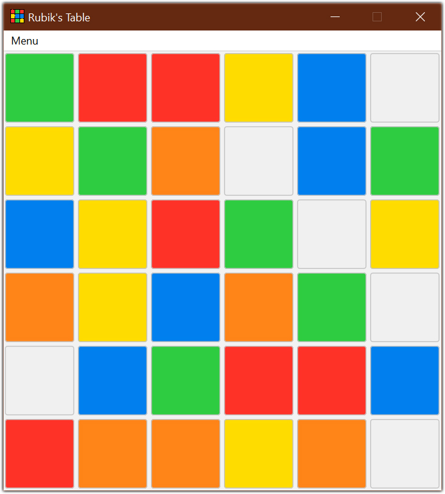

# Rubik's Table
I made Rubik's Table during the fall of 2020 for my Programming Technology class. You can beat the game by aligning each color horizontally or vertically.

My goal was to create my first Java Swing app and use Launch4J to bundle it into a .exe file.

| | |
|:-------------------------:|:-------------------------:|
|   |  |
|  |  |
|  |  |
|  |  |

# Skills Demonstrated
* Built a simple game using Java Swing and implemented a system that solves it automatically.
* Created a .exe file using Launch4J.

# Technologies Used
* Java
* Java Swing
